As with all the challenges the binary is stripped.

Using Ghidra we can analyze it and it will detect the functions present. But there is still no main.
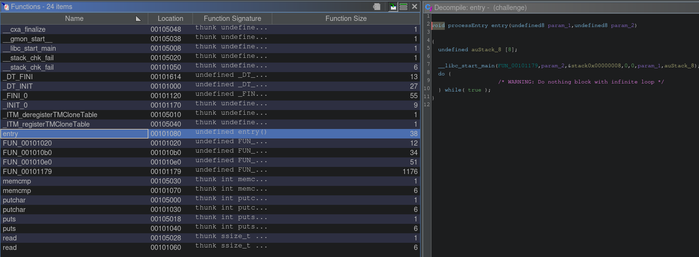

But there is an entry. The entry is the function that initialize the process and calls the main function, therefore in this case the "FUN_00101179" that Ghidra detects must be the main.

We can rename values and functions in Ghidra (with the L key) and also the signature.
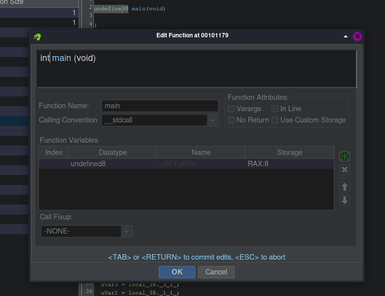

We see that the code calls read to read up to 38 (0x28) bytes from stdin and stores it in a buffer.
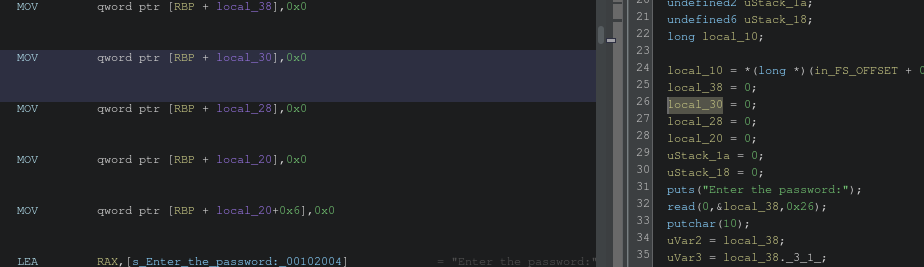
We can see the assembly code on the left and how it initializes `32+6` bytes to zero on the stack.

Let's rename it to `input` and change the type to `char[38]`
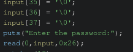
Now that ghidra knows the type of it it can display it better.

It then starts performing various operations on the user input.

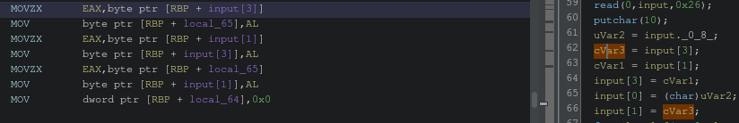
Looking at the assembly code we can see that it loads the third index of our buffer (basically the character of the sting) to a register, then moves the byte to another part of the stack.
Then moves the first index of the buffer to the third index and that temporary value that was storing the 3rd index character gets moved to the first. (arrays start counting at 0).
Effectively what this does is a swap of two indexes.

Lets add a comment to reflect that.

Next there seems to be a for loop that xors the equivalent character of the input string based on if its index is divisible by 2, using a key of `0x2aex`.
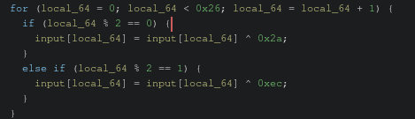

Next it seems to reverse the array
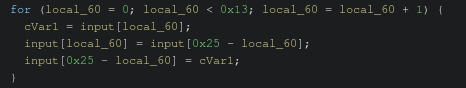

Adding comments can help us keep track of all the things the program tries to do and makes the reverse engineering process easier
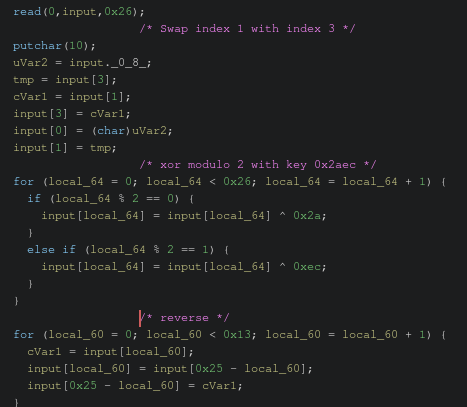

The rest are similar to this and there is no reason to go through all of them in detail.

Lastly it compares the mangled input we provided with a global variable.
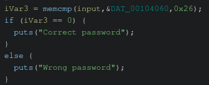

Looking into the global variable we see it's value in hexbytes.
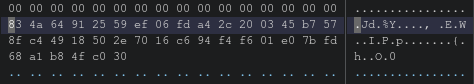

If we could reverse the entire process starting from this initial value we could get an unmanaged value. Providing that value as input the process would try to mangle it and end up with the original value which would means that the `memcmp` would return zero and therefore go inside the if statement, showing us the "correct password" text

I wrote an exploit code in python that can automate the process and sent it to the binary using pwntools.
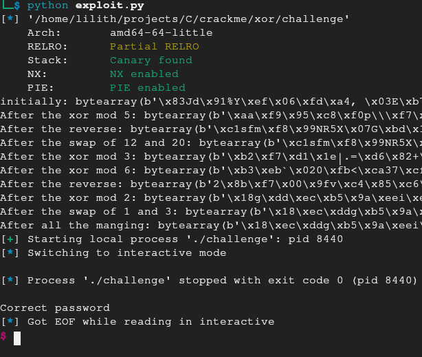
