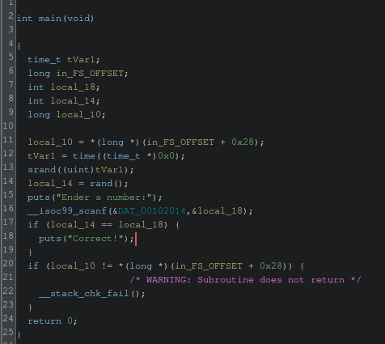
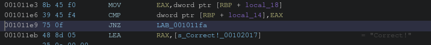
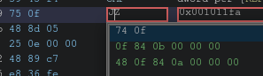
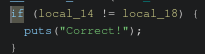
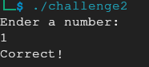

Looking at the main function we see that the program is using `srand` with the current time as a seed. The number is supposed to be the secret number we need to guess.

This time it's harder to get the password by reverse engineering it.
What we could instead do is to "patch" the binary.

The code compares the input number with the secret number. If the are equal it enters the if code and prints out "Correct!".

In assembly this look like this.

`jnz` is the opcode 75 0F.
The opcode for the opposite, `jz` is 74 0F, one byte difference.

Changing that single byte would make the reverse the logic.
Lets try it out patching the instruction! (ctr+shift+g)

which would make this

As long as we provide the wrong number, the check will succeed now.

Once we make the changes we can choose to export the file (O) as "Original file".
The file by default will not be executable, we can change that easily with `chmod`.

Now when we run it we can just provide any random number and it most likely will not be the secret number (unless you are really unlucky).

