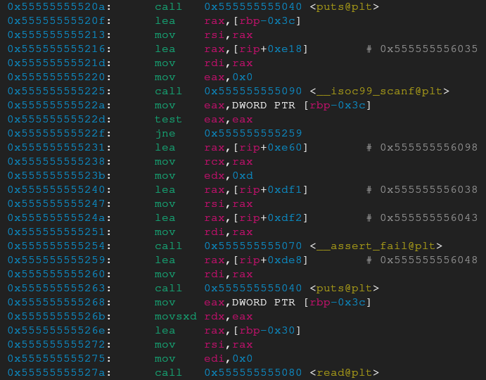

Let's start by running the `file` command on the binary.

As we can see it's a 64bit ELF, stripped binary, which means no symbols.

Using checksec on the binary we can see that the there is a stack canary present and also it's Position Independent Executable.
Also the NX is disable, meaning that the stack is executable.

Running it we see that it's asking for a size and then for user input of that specified size and lastly it prints out the user input.

We could use Ghidra to decompile the binary and understand how it works, but lets instead use gdb to see it in action and analyze it dynamically. I m using GEF with gdb, plus I set up the $BASE value to make it easier to navigate addresses since the binary is stripped, but you don't have to do any of these. It's just for convenience.

Since the binary is stripped we can't just "break" in main. We have to instead run `start` which places us in the `_start` and from there we can find the address of main.

In this case its `0x00005555555552fe`.

Fortunately gdb starts the process as if it doesn't have ASLR and therefore the addresses are not randomized. Instead it will use as a base address of whatever you have as your $BASE (you can set it in the .gdbinit file).

From this we can finally find the address of main and place a breakpoint and "continue".
`b *0x00005555555552fe`

Since we don't have symbols, we don't have functions and we can't use "disassemble". Instead we can examine the next instructions after the instruction pointer `x/16i $rip`

The main function is calling another function, `0x5555555551a9`. Setting up a breakpoint and continuing we can examine this new function.

We can see that it uses scanf to get a digit from stdin and then reads that many bytes from user stdin, storing it in `[rbp-0x30]`

further back we also see when rbp-0x30 was initialized

which tells us its a 32 byte size buffer.

lets place a breakpoint in that read.

Examining the stack we see the buffer plus padding, but also we see the canary (The canary is the one that starts with 00 in the least significant byte), the stack base pointer (rbp) and the return address to main.

From this we deduce that the program initializes a buffer of size 32 and reads as many bytes to it as we say. This could overflow the buffer and overwrite the stack frame if a large enough input is provided.

The classic way to exploit a buffer overflow is to provide large enough input to overflow the return address and when the function finishes and tries to return back to the function that called it (in this case main) it will return to our overwritten value instead.
The problem is that the program has a stack canary and is PIE. Both are mitigations that can prevent us from exploiting it.

The canary is a randomized value that is chosen at the start of the process. At the end of each function it will verify if the canary is present and unchanged. If so, it returns to wherever the return address is pointing to. If not, it means something overwrote the stack and aborts the process.

PIE randomize the virtual memory address of the binary at the start of the process making it so that even if we could overwrite the return address we wouldn't be able to land at a valid address.

The only way to consistently bypass both of those mitigations is by leaking the canary and also some valid address.
Leaking the canary would allow us to overwrite the stack with the correct canary and bypass the check.
Leaking an address would allow us to effectively find other addresses relative to that, since the offsets (three least significant nibbles) are always the same in each execution. 

But how can we leak them? 
Fortunately the program outputs our input. If we could fill the stack frame with non null bytes, up until the canary (plus it's first byte, since that is always a null byte) then when it prints our input it will also print everything in the stack up until it reaches a string terminating null byte. In this case it will print the bytes of the canary plus the stored stack base pointer.
With these values we can bypass both the canary check and the PIE! But that's still not enough, because if the process exits normally these values will be useless the next time the process starts again. They are only valid for the current process.

Looking more into the assembly we see that the program calls `strstr` with some string literal and our input.

Examining the string we see that it's the word `BLACKDOOR`.

If it finds this string in our input then it calls the same function again, allowing us to send more user input and overwrite a new stack frame.

Since we are still in the same process the canary and stack base pointer will be relevant and we can perform our exploitation... But where should we return?

Remember that checksec showed us that the NX flag was not set during compilation. That means that the stack is executable! And since we can overwrite the stack we could overwrite it with shellcode and return on the stack. Since it's executable the program would execute the assembly instructions that it would recognize from our shellcode, giving us command execution.

So, to recap our exploitation plan.
- We craft an input with enough padding to overwrite the buffer, just enough to perform a buffer overread and leak the canary and a stack address.
- Don't forget to also include the word "BACKDOOR" to repeat the function
- Then we need to load up our shellcode with the code we want to execute (also include the word backdoor at the end to trigger the function call again)
- And finally the third payload we need to send is the padding plus the canary, plus the return address we want to overwrite, which will be the address that our shellcode is loaded, aka the buffer address of the second payload.

I wrote a python exploit script using pwntools and a reverse shell shellocde.

Bam! Reverse shell!!
