Let's start with a `checksec` on the binary

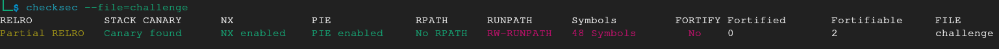

We see that PIE is enabled, there's stack canaries and the stack is non executable. Pretty standard things.

RELRO is partial which means we could theoretically overwrite the GOT if we had an appropriate bug...


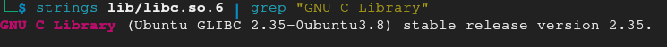

But notice how it uses its own glibc. Looking into the library files we see that it's an older version, 2.35.

# Finding the Bug
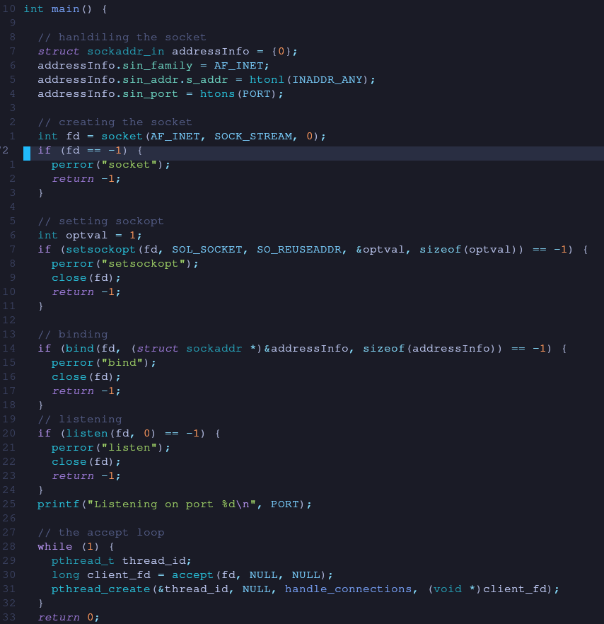

Looking into the code we see that it's main is a typical server using multithreading.
The thread it spawns is using the function `handle_connections` and passes as argument the file descriptor it gets from accepting a connection.

In the function we see that it calls a `challenge` function.

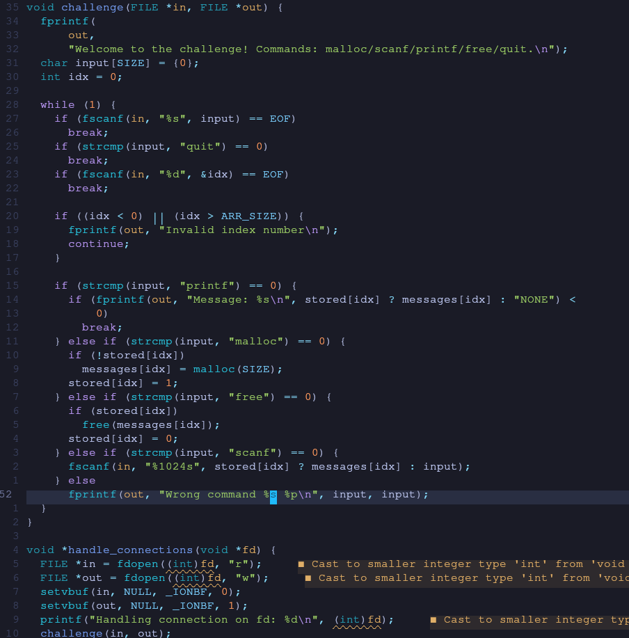

Inside that we see that the program prompts the user with a few options that it stores in a 1024 size buffer, alongside an integer using scanf.

Then it checks if the user input string matches the words "malloc", "printf", "free" "scanf" and "quit".

- For the malloc it checks if a value from a global array, "stored" its zero. If so, it calls malloc with the size 1024 (0x400), stores it in the global array "messages" based on the index provided by the user and then updates the "stored" array to be 1 in that same index.

- For the "free" it checks if the equivalent stored value is non zero and if it is frees the chunk in messages and sets stored to zero.

- For printf it prints whatever value is stored in the malloc in the messages array if the stored value is non zero, otherwise it prints NONE.

- For the scanf it checks if the stored in the particular index is non zero, if so it overwrite the value in the malloc chunk in the messages array up to 1024 characters.

- Finally quit just returns the function.

So what this function does is it takes user input from a network connection and does dynamic memory allocation, stores these pointers in a global array and keeps track if a chunk has been freed or not with a second global array to allow any read or writing. 

The program looks safe enough, for a single threaded application. But this program spawns multiple threads and accesses shared memory, the global values, from every thread with no mutexes or semaphores, leaving it open to potential race conditions.

With that in mind let's look at it again.

In order to read the value stored in a malloc we need the equivalent "stored" value to be non zero, but when we free an allocation the "stored" value becomes zero, preventing us from leaking the "Next" pointer in the tcache bin from the metadata.
With a race condition there is a race window between freeing the chunk and changing the global value of stored. If we can printf, in that window we could leak the metadata.
Same thing with scanf and overwriting the metadata.

A thing to note when dealing with heap exploitation is the verion of glibc. Let's look at the source code of malloc for this particular version on github.
Specifically the `_int_free` function.

If you are familiar with the way ptmalloc works in glibc skip ahead.
# Safe Linking
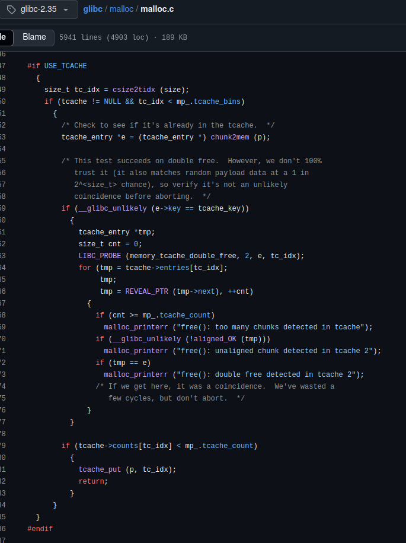

When we call "free" on a chunk, if it's placed on the tcache, ie the tcache bin is not full (up to 7 chunks) and the size doesn't exceed 1030 bytes, it calls the `tcache_put`.

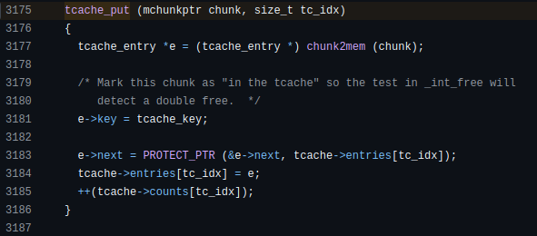

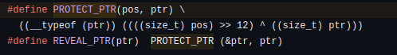

Following that, we see that whatever was written in the location pointed to by the pointer returned by malloc, is overwritten by a mangled pointer to the next entry of the tcache, using the `PROTECT_PTR` which mangles it using certain bitwise shifts and xors, the so called Safe Linking.

Whats more important though is the `tcache_get` which gets called when we malloc something.

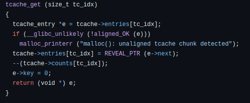

It checks if the next entry of the chunk is "aligned" using the `aligned_Ok` macro which bitwise "and" it with the `MALLOC_ALIGN_MASK`.

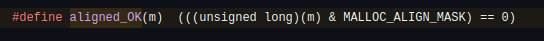
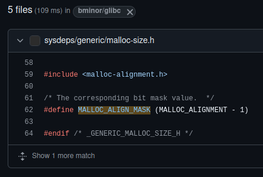
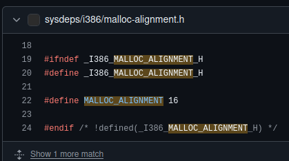

Looking into that we see that its `MALLOC_ALIGNMENT -1` and from that we see that `MALLOC_ALIGNMENT` is the number 16.
Performing an AND operation on an address with the number 15 (0b1111) ensures that every bit will get zeroed out, except for the four least significant bits. If any of those bits were 1, they will remain after the AND, which would give us a non zero value overall.
That would make the `aligned_OK` "false" and would fail the assertion.

What this effectively does is it makes sure our pointer has the least significant nibble (4 bits, aka half a byte) to be 0.
Any pointer that doesn't end in 0x-0 will fail, ensuring alignment.

If we leak this mangled pointer, we can reverse it using Math and get the pointer that it points to. From there we can calculate the original position of the mangled, cause we know the size of each chunk (0x410 with the metadata) and with that we can craft our own mangled pointers to overwrite the next entry so that when we malloc that free chunk it will poison the tcache next entry, ensuring that, if the bin is still not empty, the new malloc after will have the address pointed to by our mangled value. Assuming we did the math correct and we took into account stack alignment.

We can deal with safe linking with the following python code

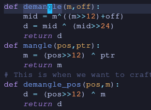

the function mangle is what we already saw from the source code. it takes a "position" pointer and a "next" pointer in the form of "pos" and "ptr" respectively.

For those allergic to math, just skip the next section.
If you are interested in how the math works out to get those function, keep reading.

### The Math
In order to demangle a mangled pointer when we know the position address we can use the `demangle_pos` function. why? We know that the XOR operation follows the rules of association. that means that `(a ^ b) ^ c == a ^ (b ^ c)`, but most importantly we know that XOR-ing a value with each self is 0. 
```
x = 0b10101010
^   0b10101010
----------------
	0b00000000
```
And XORing any value with 0 is equal to the original value
```
x = 0b10101010
^   0b00000000
----------------
    0b10101010
```

That means
```
mang = (pos>>12) ^ ptr =>
mang ^ ptr = (pos>>12) ^ 0 =>
ptr = mang ^ (pos>>12) =>
ptr = (pos>>12) ^ mang
```
Note also that usually ptr and pos have the same bytes when you `>>12`, unless they happen to be in separate pages, which in that case there would be an offset. 

But what about if we only know the manged pointer and nothing else?
Thats a bit trickier.

lets say we have ptr and pos.
```
ptr 0123456789ABCDEF
pos 0123456789ABXBBB

X instead of C for the case that it falls to a different page. The last three nibbles are BBB becuse they dont matter, since it gets >>12

The mangled pointer will then be

man:
0123456789ABCDEF
^  0123456789ABX

Lets represent it as "man" and as an xor of two values.
Lets now try to bitshift it by >>12 and >>24

man12:
0123456789ABC
^  0123456789

man24:
0123456789
^  0123456

When we try to xor man12 and man24 the "0123456789" will get xored out, leaving us with

man12 ^ man24:
0123456789ABC
^     0123456

Lets call that mid

mid:
0123456789ABC
^     0123456

mid24:
0123456
^     0

Similarly, xoring these two together we would get

mid ^ mid24:
0123456789ABC
^           0
Which happens to be the ptr >> 12 from before!

Remember that pos >> 12 is almost ptr >> 12, +- some offset and that 
ptr = (pos>>12) ^ man
which can be (ptr>>12) ^ man with some offset, give or take.

man ^ ptr12:
0123456789ABCDEF
^  0123456789ABX
0000123456789ABC
^              0

which is like saying

man ^ ptr12:
0123456789ABCDEF
               X
               C
as we can see this is just one nibble away from ptr that we could try guessing


Putting it all together now, we have:
ptr = man ^ ptr12
ptr12 = mid ^ mid24
mid = man12 ^ man24
mid24 = man36 ^ man48

And so
ptr = man ^ (mid ^ mid24) =>
ptr = man ^ ((man12 ^ man24) ^ (man36 ^ man48)) => man48 is just zeros cause addresses are 48 bits long

ptr = (man ^ man12) ^ (man24 ^ man36)

So if we can (man ^ man12) as X, then X>>12 is (man24 ^ man36)

And thus
ptr = X ^ X>>12, where X = man ^ man12

And in python it translates to what is shown in the screenshot ,give or thake an offset to account for the pages.
```

Now with all the math out of the way, what's the plan?

# PLAN
We meed to allocate two consecutive chunks, let's say stored in index 0 and 1 of the "messages" and then free them in reverse order.
That would place the last freed, let's say chunk 0, on the top of the bin. It's next entry is the mangled address of the chunk 1.

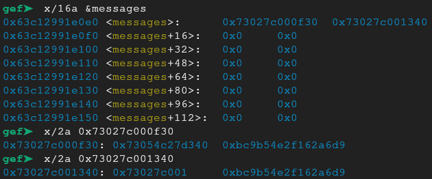

`messages[0]` and `messages[1]` respectively have the freed chunks as mentioned above, alongside their tcache metadata.
The first chunk has a mangled pointer to the second chunk. The second points to the HEAD.

We need to exploit the *race condition* to leak, using printf, the contents of chunk 0, demangle that value and calculate the address of chunk zero. With this address we can bypass the *safe linking* by mangling any address we want for this particular chunk and poison the tcache next entry, which would follow the demangled address to allocate a chunk next time malloc is called and placing that address in the global array. Then it's only a matter of using printf on it and leak the contents, giving us an arbitrary **read primitive**.

In order to get an **arbitrary write** on any address we follow the same process, only instead of finally using printf, we use scanf.

Keep in mind that we can only perform these primitives on addresses with their least significant nibble to 0.

Alright, that sounds like a plan, but we don't know where anything is.
We could overwrite the return address and perform ROP, but we don't know where the stack is. And even if we did we don't know the base address of the binary, nor libc.

For this we need to snoop around in memory.

# Forensics
Lets use GDB for some sleuthing.

We can easily get the address of the heap chunks from the first *race condition*, as mentioned. But that only gives us access to the current thread's heap and arena.

Taking a look at this heap we find an address to libc.

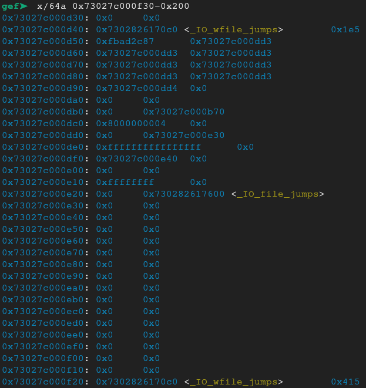

The -f20 address ends in a whitespace, '0x20' which is a bad character for scanf and therefore is a bad pick. The e28 is not aligned and would cause a sigabort. That would leave the d40 ,which is great for what we need.

With that address we can calculate the libc base.

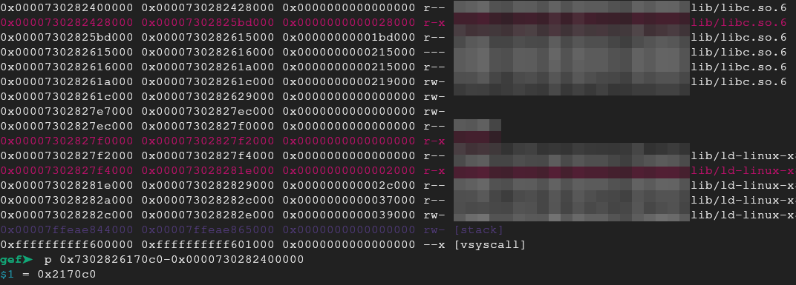

The libc is contiguous in memory with the per thread stack, so having a libc leak means we know also the location of the stack for the current thread.
From there we can leak the stack, but only 8 bytes from an align address, ie Not the return address, since that is always 8 bytes next to stored rbp, which is stack aligned.
We also can't overwrite the stored rbp to leak the ret next to it because scanf always includes a null terminating byte, so no buffer overreads.

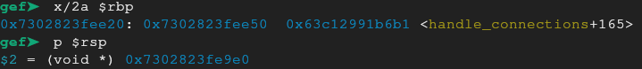

Using gdb again we see another address in the stack that holds a pointer to the binary that is stack aligned!

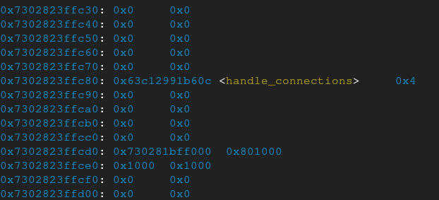

Another way would be to use the "scan" build in command in GEF.
The *haystack* would be the entire memory where the thread stack is and the *needle* would be the entire region where the binary code is, which makes things a lot easier.

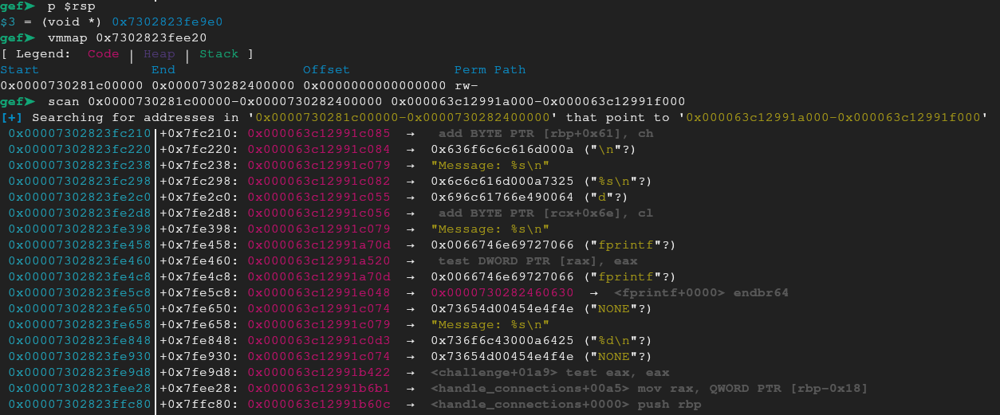

With that we can finally calculate the base address and now we know the location of everything in the binary, the thread heap and stack and libc and we can finally overwrite the return address with a ROP chain, gaining execution flow and ret2libc to execute any command in libc that we want, such as execve with `/bin/bash`.

Another thing to note is that the way we input bytes in the binary is scanf, which disregards whitespace characters. That means that all the addresses we work with need to not have whitespace characters. That goes for our ropchain as well.
To work around this we can use arbitrary write on an address 0x10 before, or overwrite everything in between with padding.
Or we can spawn a new thread and hope the addresses there will be better (but we would need to recalculate the offsets to the thread stack).

In summary.

# Summary
What we need to do is abuse the *race condition* to mess about freely with the heap.

Develop an **arbitrary read** primitive to leak addresses from the thread's heap and the libc.
From there we can calculate the thread's stack and leak any value on it, such as an address to the binary.

Then develop an **arbitrary write** primitive and create a ROPchain to execute any command we want from libc by overwriting the return address of the function so that when we provide the "quit" command our ROP gets triggered.

Using the python script i wrote:

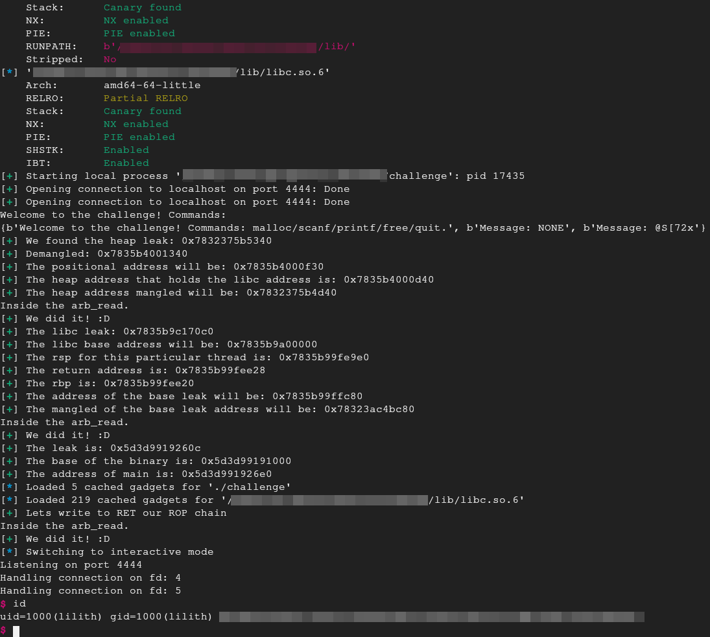

RCE :D
